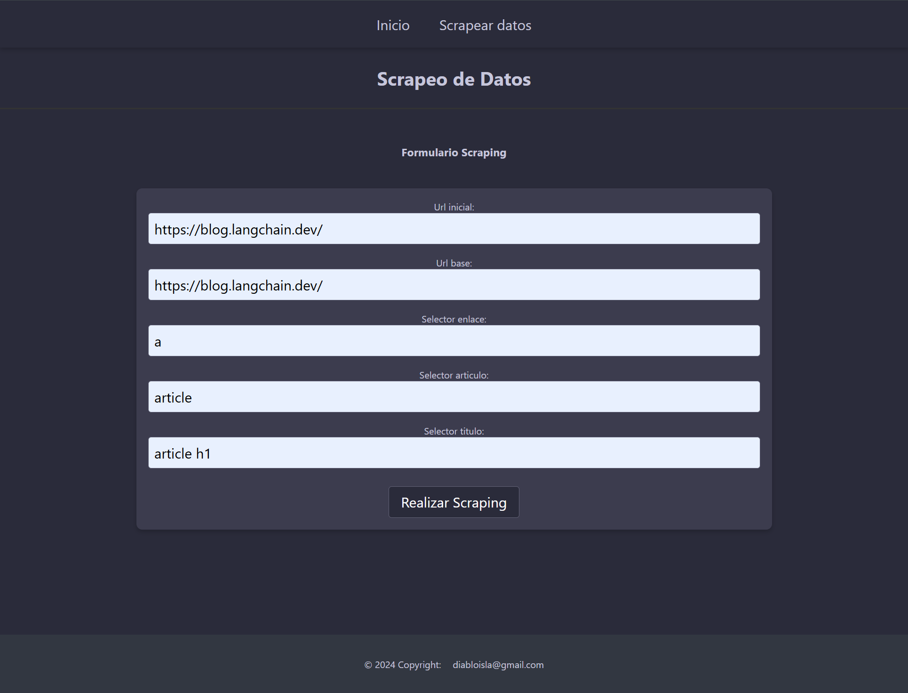
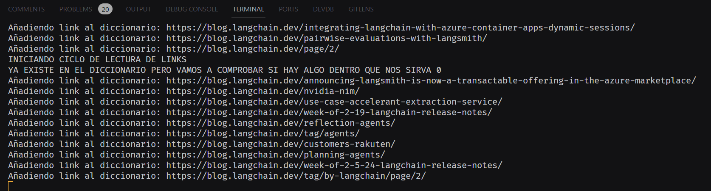
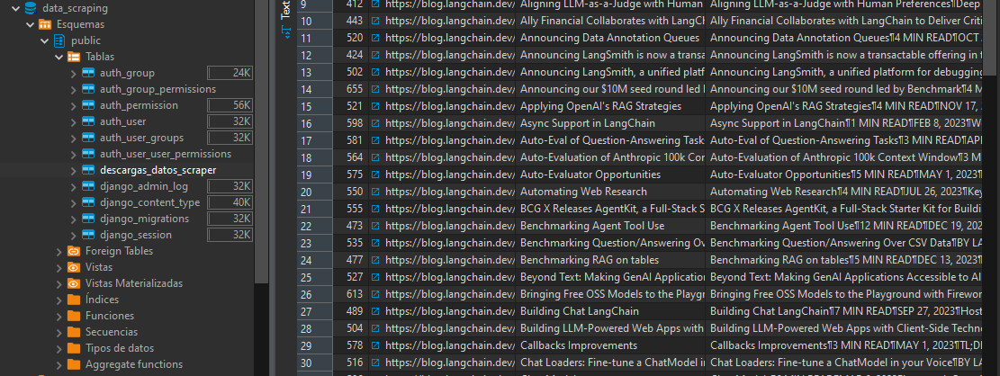

# Interfaz Web para Scrapear Datos
___
### 1. Resumen
Interfaz enfocada en scrapear datos de webs y almacenarlos en una base de datos (BD).

Creé este proyecto ya que tengo pensado afinar un modelo de lenguaje (LLM) en distintas especialidades y para ello necesito datos actualizados de las documentaciones en las que quiera afinar su conocimiento. Para ello, he creado esta interfaz a la que, añadiéndole en el formulario distintos parámetros, se pueden scrapear los datos y almacenarlos en una base de datos relacional. 

En otro proyecto tengo pensado usar esos datos para vectorizar los datos y pasarlos a una base de datos vectorial o RAG y así poder afinar la respuesta del LLM.


<div style="display:flex; justify-content:center; align-items:center;">
   
</div>

___


### 2. Requerimientos

```bash
pip install Django
pip install django-environ
pip install psycopg
pip install beautifulsoup4
pip install selenium
pip install undetected-chromedriver
```

___

### 3. Vista rápida
Primero en un archivo .env en la ruta inicial del proyecto se crea este archivo que contendra los datos internos del proyecto:

```py
# Datos de ejemplo
SECRET_KEY="django-insecure-aº123!f7)6#vi*bu2asdasdwasa^hx6jn23d*%%=asdasdasb4"
DEBUG=True
DATABASE_NAME="data_scraping"
DATABASE_USER='postgres'
DATABASE_PASSWORD="bn234Nb"
DATABASE_HOST="127.0.0.1"
DATABASE_PORT="4000"
```

Usando las URLs de la web que se quiere scrapear (URL_inicial y URL_base, ya que aveces varian o solo se quieren conseguir ciertas urls) y los selectores (CSS) se configura y se pulsa Realizar Scraping.


<div style="display:flex; justify-content:center; align-items:center;">
   
</div>

___

Esto iniciara a scrapear los datos y a guardarlos en la BD todos los datos únicos scrapeados:

___


<div style="display:flex; justify-content:center; align-items:center;">
   
</div>


___
